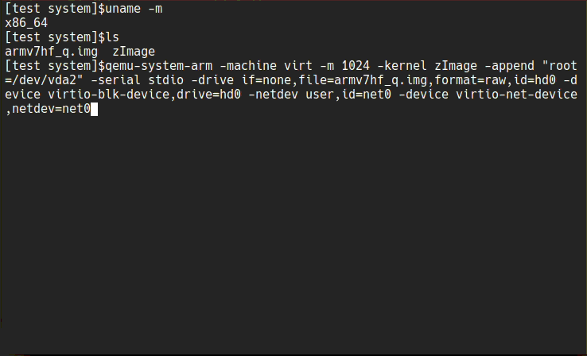

### Custom linux kernel for old armv7 [chromebook](https://www.samsung.com/us/support/owners/product/chromebook-xe303c12)

>[short demo](https://www.youtube.com/watch?v=hZt1fPso0e0) of running linux on this device.

#### [archlinux|ARM folder](archlinuxarm) 
- [kernel](archlinuxarm/linux_xe303c12) - Forked from [archlinux|ARM](https://github.com/archlinuxarm/PKGBUILDs/tree/master/core/linux-armv7). Archlinux|ARM package build script. Difference:
  - lighter and faster as a result of build for specific hardware and not for whole armv7 platform
  - single package for kernel, headers and flash image
  - no initrd (any way it is not used)
  - detects Chrome OS Kernel partition for flashing kernel
  - lets user to change kernel boot string during installation (with some conditions)
  - support samsung\google snow - [XE303C12 chromebook](https://archlinuxarm.org/platforms/armv7/samsung/samsung-chromebook) only.
  
 - [firmware](archlinuxarm/linux_xe303c12_firmware) - Archlinux|ARM package build script. It collect a couple of necessary files and saves some space compared to regular linux-firmware.
 - [some forked apps](archlinuxarm/some_forked_apps) may run faster than from repo or may not

Some (not all) packages from [AUR](https://aur.archlinux.org) could be installed by [sfslib](https://github.com/quarkscript/Simple_func_scripts/blob/master/sfslib) like `./sfslib armget 'pkg name'`

#### [Void-linux folder](voidlinux)
The same, but for void-linux. Second forked source is [void-packages](https://github.com/void-linux/void-packages/tree/master/srcpkgs/linux5.8). 

- [kernel](voidlinux/linux_xe303c12) - Void-linux package build script can be cross-compiled with [xbps-src](https://github.com/void-linux/void-packages) into void-linux package with armv7hf-glibc or armv7hf-musl architectures.
- [firmware](voidlinux/linux_xe303c12_firmware) - Void-linux package build script. It collect a couple of necessary files and  takes up less space than a regular linux-firmware package.
- [xorg video driver](voidlinux/xf86-video-armsoc-git) - Void-linux package build script, forked from [archlinux|ARM](https://github.com/archlinuxarm/PKGBUILDs/tree/master/alarm/xf86-video-armsoc-git) (at least it works for xfce4)

> Some already builded packages can be found at [releases](https://github.com/quarkscript/linux-armv7-xe303c12-only/releases)


#### Kali linux
To try Kali on that device you may use [official build script from Kali developers](https://gitlab.com/kalilinux/build-scripts/kali-arm/-/blob/master/chromebook-arm-exynos.sh) 
or [my old mod of that script](https://github.com/quarkscript/xe303c12_play_linux)


#### Recovery / install / test disk images
- based on archlinux|ARM 
  - [disk image 1](https://drive.google.com/u/0/uc?id=1O94t7i_gBygdlDLsbyp9D8q7T425sgpM&export=download) ( console, works on baremetal and under qemu )
  - [disk image 3](https://drive.google.com/u/0/uc?id=1qo4ExfRGK1Sl-Vv_2SRPctM7H7I330y0&export=download)
- based on Void-linux
  - [glibc disk image](https://drive.google.com/u/0/uc?id=1NrCXfS1krKrBMtfB4m1oucXhcHCUskDM&export=download) ( kernel 5.13.13 / console )
  - [glibc disk image 2](https://drive.google.com/u/0/uc?id=1prHyOl-S5euqLSqer6FYr2tPVegYzjWv&export=download) (autologin to X)
  - [musl disk image](https://drive.google.com/u/0/uc?id=1b-m4jN2mhNCJIXiOvEJd8gTNfFtY6gq5&export=download) ( kernel 5.13.13 / console )
  - [musl disk image 2](https://drive.google.com/u/0/uc?id=1VCeMJ8nL8YOCyVMhgLTxi8Vvlqvva7Sg&export=download) (autologin to X)
- based on Kali linux
  - [disk image](https://drive.google.com/u/0/uc?id=1meNMjZaphdySOPjudi1tr-4pjXMNLCBm&export=download) ( kernel 5.13.8 / autologin to X)

> X may not work on "console"-s disk images until an updated version of mesa is released on the appropriate distro

 [empty disk image maker](edim) can be used to create a disk image of the required size, then just copy the contents of the root partition into it and write the kernel image to the kernel partition.

#### Example of run under hypervisor (qemu)
```
qemu-system-arm -machine virt -m 1024 -kernel zImage -append "root=/dev/vda2" -serial stdio -drive if=none,file=armv7hf_q.img,format=raw,id=hd0 -device virtio-blk-device,drive=hd0 -netdev user,id=net0 -device virtio-net-device,netdev=net0 
```


 zImage could be extracted from second partition of disk image like:
```
mkdir dsk
sudo mount -t btrfs -o,loop,offset=$((512*40960)) armv7hf_q.img dsk
cp dsk/boot/zImage zImage
sudo umount dsk
```

#### Example of cross-compiling Void-linux packages 
(from any x86_64 linux)
``` 
git clone git://github.com/void-linux/void-packages.git
git clone https://github.com/quarkscript/linux-armv7-xe303c12-only.git
cd void-packages/

## copy templates to src-dir
  cp -fr ../linux-armv7-xe303c12-only/voidlinux/linux_xe303c12 srcpkgs/
  cp -fr ../linux-armv7-xe303c12-only/voidlinux/linux_xe303c12_firmware srcpkgs/
  cp -fr ../linux-armv7-xe303c12-only/voidlinux/xf86-video-armsoc-git srcpkgs/
    
## downgrade uboot-tools template
  sed -i "s/version=.*/version=2020.10/g" srcpkgs/u-boot-tools/template
  sed -i "s/revision=.*/revision=1/g" srcpkgs/u-boot-tools/template
  sed -i "s/checksum=.*/checksum=0d481bbdc05c0ee74908ec2f56a6daa53166cc6a78a0e4fac2ac5d025770a622/g" srcpkgs/u-boot-tools/template

##############################################################

## make glibc kernel package
  ./xbps-src binary-bootstrap
  ## build host uboot-tools package
    ./xbps-src pkg u-boot-tools
  ./xbps-src -a armv7hf build linux_xe303c12
  ./xbps-src -a armv7hf pkg linux_xe303c12

## make glibc firmware package
  ./xbps-src -a armv7hf pkg linux_xe303c12_firmware

## make glibc X- video driver package
  ./xbps-src -a armv7hf pkg xf86-video-armsoc-git

##############################################################

## make musl kernel package
  ./xbps-src -m x86_64-musl binary-bootstrap x86_64-musl
  ## build host-musl uboot-tools package
    ./xbps-src -m x86_64-musl pkg uboot-mkimage
  ./xbps-src -m x86_64-musl -a armv7hf-musl build linux_xe303c12
  ./xbps-src -m x86_64-musl -a armv7hf-musl pkg linux_xe303c12 

## make musl firmware package
  ./xbps-src -m x86_64-musl -a armv7hf-musl pkg linux_xe303c12_firmware

## make musl X- video driver package
  ./xbps-src -m x86_64-musl -a armv7hf-musl pkg xf86-video-armsoc-git
```
 Since the signing of the kernel may fails with the latest uboot-tools, downgrade of uboot-tools may be required.

 If you plan to re-sign kernel during installation then you will need to install a builded uboot-mkimage/uboot-tools firstly.

> Be aware! Given scripts or packages are not officially supported by any mentioned Linux distributions.
