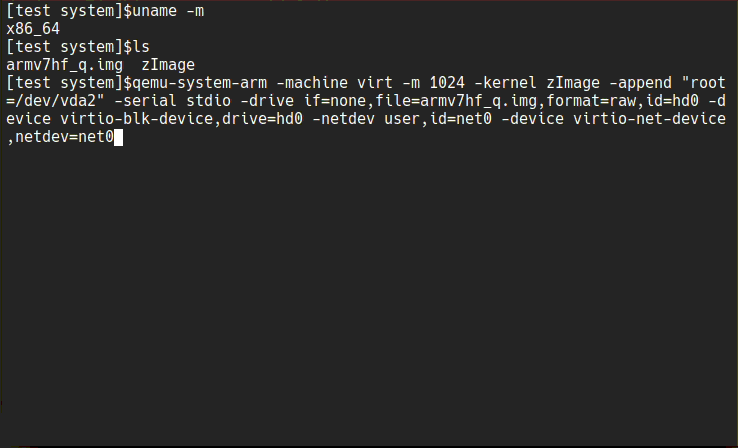

### Custom linux kernel for old armv7 [chromebook](https://www.samsung.com/us/support/computing/chrome-device/chromebook/chromebook/?modelCode=XE303C12-A01US)

>[short demo](https://www.youtube.com/watch?v=hZt1fPso0e0) of running linux on this device.

#### [archlinux|ARM folder](archlinuxarm) 
- [kernel](archlinuxarm/linux_xe303c12) - Forked from [archlinux|ARM](https://github.com/archlinuxarm/PKGBUILDs/tree/master/core/linux-armv7). Archlinux|ARM package build script. Difference:
  - lighter and faster as a result of build for specific hardware and not for whole armv7 platform
  - single package for kernel, headers and flash image
  - no initrd (any way it is not used)
  - detects Chrome OS Kernel partition for flashing kernel
  - lets user to change kernel boot string during installation (with some conditions)
  - support samsung\google snow - [XE303C12 chromebook](https://archlinuxarm.org/platforms/armv7/samsung/samsung-chromebook) only.
  
 - [firmware](archlinuxarm/linux_xe303c12_firmware) - Archlinux|ARM package build script. It collect a couple of necessary files and saves some space compared to regular linux-firmware.
 - [some forked apps](archlinuxarm/some_forked_apps) may run faster than from repo or may not ( [builded](https://github.com/quarkscript/linux-armv7-xe303c12-only/releases/tag/some_apps_21.10.04) )

Some (not all) packages from [AUR](https://aur.archlinux.org) could be installed by [sfslib](https://github.com/quarkscript/Simple_func_scripts/blob/master/sfslib) like `./sfslib armget 'pkg name'`

#### [Void-linux folder](voidlinux)
The same, but for void-linux. Second forked source is [void-packages](https://github.com/void-linux/void-packages/tree/master/srcpkgs/linux). 

- [kernel](voidlinux/linux_xe303c12) - Void-linux package build script can be cross-compiled with [xbps-src](https://github.com/void-linux/void-packages) into void-linux package with armv7hf-glibc or armv7hf-musl architectures.
- [firmware](voidlinux/linux_xe303c12_firmware) - Void-linux package build script. It collect a couple of necessary files and  takes up less space than a regular linux-firmware package.
- [mesa](voidlinux/xf86-video-armsoc-git) - Void-linux package build script, forked from [void-packages](https://github.com/void-linux/void-packages/tree/master/srcpkgs/mesa)
- [xorg video driver](voidlinux/xf86-video-armsoc-git) - Void-linux package build script, forked from [archlinux|ARM](https://github.com/archlinuxarm/PKGBUILDs/tree/master/alarm/xf86-video-armsoc-git) (it looks like no more required)

> Some already builded packages can be found at [releases](https://github.com/quarkscript/linux-armv7-xe303c12-only/releases)


#### Kali / Devuan linux
To try Kali on that device you may use [official build script from Kali developers](https://gitlab.com/kalilinux/build-scripts/kali-arm/-/blob/master/chromebook-arm-exynos.sh) 
or [my rewrited mod of that script](https://github.com/quarkscript/xe303c12_play_linux) Devuan linux disk image could be build with rewrited script too.

#### test disk images
Disk images created for demonstration, testing and recovery things. For daily use user should tune it to his own needs and upsize it to used pendrive, sdcard and so on. 

[empty disk image maker](edim) could be used to create an empty disk image of the required size [demonstration](https://youtu.be/ALJR2doOipc)

Created disk images:
- based on archlinux|ARM 
  - [minimal, console only (old)](https://drive.google.com/u/0/uc?id=1O94t7i_gBygdlDLsbyp9D8q7T425sgpM&export=download)
  - [minimal, console only](https://drive.google.com/u/0/uc?id=1H7-WnYNJtQDMwrfvdIBnLnrswquFC1av&export=download)
  - [with xfce4 DE](https://drive.google.com/u/0/uc?id=1yTRChwYdWFl-0z06p19kZ0leLGR2vEyp&export=download) . . . . . . . . . [screenshot](pics/archlinuxarm_xfce4.png)
- based on Void-linux
  - [glibc, minimal, console only](https://drive.google.com/u/0/uc?id=1m4GPpz1W4meUyvFn0byTxbK-zENSg96X&export=download)
  - [glibc, with xfce4 DE](https://drive.google.com/u/0/uc?id=1ylcaJ4aiyN4Zl5GqmietmcGmgIhWoElo&export=download)
  - [musl, minimal, console only](https://drive.google.com/u/0/uc?id=1H5JzkGVWHtZeh1a0CgZciRosZtVrSiZg&export=download)
  - [musl, with xfce4 DE](https://drive.google.com/u/0/uc?id=18ExLAz0M_gnjUF4PvsBnDo-0EnA4XZ6h&export=download) . . . . . . . . . [screenshot](pics/void_musl_xfce4.png)
- based on debian linux
  - [Kali with xfce4 DE](https://drive.google.com/u/0/uc?id=1fW0oDNb44kXkEU_zrp_HtsZZtfphyetz&export=download)
  - [Devuan with xfce4 DE](https://drive.google.com/u/0/uc?id=1KSgE-3G2GEBzcYhk_JleVYWl6m061GdI&export=download)
  - [Devuan with lxqt DE](https://drive.google.com/u/0/uc?id=1Oil2eE-RrpP5I1kGCoTsw1JEqxeTgsNC&export=download) . . . . . . . . . [screenshot](pics/devuan_lxqt_root.png)
  - [Devuan5 with bunsenlabs UI scripts](https://drive.google.com/u/0/uc?id=1-obTOWKIbgRjQZDjjQazbOtPFHboeA8N&export=download) . . . . . . . . . [screenshot](pics/devuan-bunsen.png)
- based on alpine linux
  - [with xfce4 DE](https://drive.google.com/u/0/uc?id=108zWgPRvxzveNVtW6GChxux_jEziENZT&export=download) . . . . . . . . . [screenshot](pics/alpine_xfce.png)

> disk images updated 27.11.2022

#### Example of run under hypervisor (qemu)
```
qemu-system-arm -machine virt,highmem=off -m 1024 -kernel zImage -append "root=/dev/vda2" -serial stdio -drive if=none,file=armv7hf_q.img,format=raw,id=hd0 -device virtio-blk-device,drive=hd0 -netdev user,id=net0 -device virtio-net-device,netdev=net0 
```


 zImage could be extracted from second partition of disk image like:
```
mkdir dsk
sudo mount -t btrfs -o,loop,offset=$((512*40960)) armv7hf_q.img dsk
cp dsk/boot/zImage zImage
sudo umount dsk
```

#### Example of cross-compiling Void-linux packages 
(looks like xbps is no longer part of void-packages so this example requires Linux with [xbps-static-bin](https://aur.archlinux.org/packages/xbps-static-bin) installed or Void-linux)
``` 
git clone https://github.com/void-linux/void-packages.git
git clone https://github.com/quarkscript/linux-armv7-xe303c12-only.git

cd void-packages/

## copy templates to src-dir
  cp -fr ../linux-armv7-xe303c12-only/voidlinux/linux_xe303c12 srcpkgs/
  cp -fr ../linux-armv7-xe303c12-only/voidlinux/linux_xe303c12_firmware srcpkgs/
    
##############################################################

## make glibc build env.
  ./xbps-src binary-bootstrap
  
## make glibc kernel package
  ./xbps-src -a armv7hf build linux_xe303c12
  ./xbps-src -a armv7hf pkg linux_xe303c12

## make glibc firmware package
  ./xbps-src -a armv7hf pkg linux_xe303c12_firmware

##############################################################

## make musl build env.
  ./xbps-src -m x86_64-musl binary-bootstrap x86_64-musl

## make musl kernel package
  ./xbps-src -m x86_64-musl -a armv7hf-musl build linux_xe303c12
  ./xbps-src -m x86_64-musl -a armv7hf-musl pkg linux_xe303c12 

## make musl firmware package
  ./xbps-src -m x86_64-musl -a armv7hf-musl pkg linux_xe303c12_firmware
  
```

 If you plan to re-sign kernel during installation then you will need to install a uboot-mkimage/uboot-tools firstly.

> Be aware! Given scripts or packages are not officially supported by any mentioned Linux distributions.
